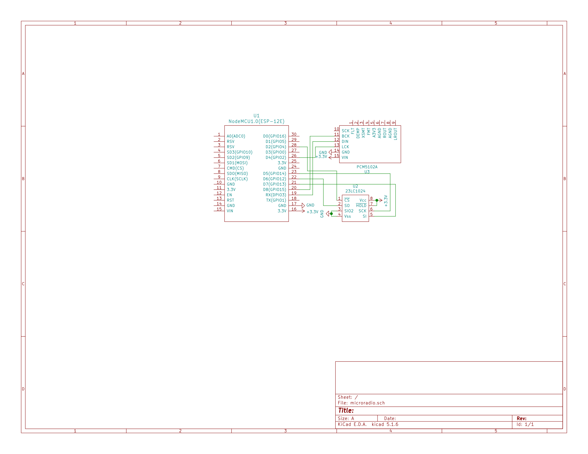

# Microradio
Internet radio player using [ESP8266Audio](https://github.com/earlephilhower/ESP8266Audio) capable of smooth playback of http audio/mpeg streams.

## Components & Schematics
- esp8266 (nodemcu)
- 23lc1024 sram
- pcm5102 dac

